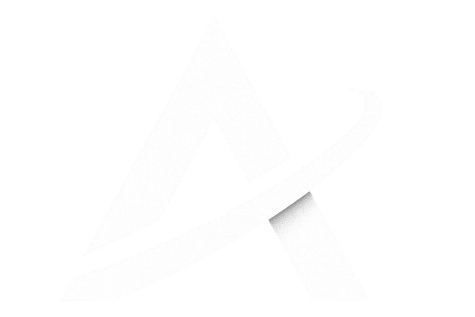

# AayraTechX - Advanced IT Solutions 🚀

<div align="center">
  
  <h3>Empowering Your Digital Journey</h3>
  <p>We help startups and enterprises build scalable, high-performance software solutions that drive real business growth.</p>
  
  [](https://nextjs.org/)
  [](https://www.typescriptlang.org/)
  [](https://tailwindcss.com/)
  [](https://www.framer.com/motion/)
</div>

---

## ✨ Features

### 🎨 Modern UI/UX
- **Premium Dark Theme** with gradient accents and glassmorphism effects
- **Interactive 3D Elements** using React Three Fiber
- **Smooth Animations** powered by Framer Motion
- **Cursor Light Trail** - A smooth, glowing light that follows the mouse
- **Scroll-to-Top Button** for improved navigation

### 📱 Pages & Sections
| Page | Description |
|------|-------------|
| **Home** | Hero section with 3D animation, services, products carousel, testimonials |
| **About** | Company overview, mission, vision, and leadership team |
| **Products** | Grid layout showcasing all products with filtering |
| **Careers** | Job listings with application functionality |
| **Booking** | Project request form with custom dropdowns and checkboxes |
| **Contact** | Interactive form, office locations, and embedded map |

### 🛠️ Components
- `Loader` - Animated loading screen with logo
- `CustomDropdown` - Stylish dropdown component
- `CustomCheckbox` - Custom animated checkbox
- `ScrollToTop` - Floating scroll button
- `CursorLightEffect` - Mouse trail animation

---

## 🚀 Tech Stack

| Technology | Purpose |
|------------|---------|
| [Next.js 14](https://nextjs.org/) | React Framework (App Router) |
| [TypeScript](https://www.typescriptlang.org/) | Type Safety |
| [Tailwind CSS](https://tailwindcss.com/) | Styling |
| [Framer Motion](https://www.framer.com/motion/) | Animations |
| [React Three Fiber](https://docs.pmnd.rs/react-three-fiber) | 3D Graphics |
| [Lucide React](https://lucide.dev/) | Icons |

---

## 📦 Installation

```bash
# Clone the repository
git clone https://github.com/projects1000/aayratechx.git
cd aayratechx

# Install dependencies
npm install

# Start development server
npm run dev
```

Open [http://localhost:3000](http://localhost:3000) to view the application.

---

## 📂 Project Structure

```
aayratechx/
├── public/                 # Static assets
│   ├── images/            # Team photos, illustrations
│   └── logo.png           # Company logo
├── src/
│   ├── app/               # Next.js App Router
│   │   ├── about/         # About page
│   │   ├── booking/       # Project booking form
│   │   ├── careers/       # We Are Hiring page
│   │   ├── contact/       # Contact page
│   │   ├── products/      # Products page
│   │   ├── layout.tsx     # Root layout
│   │   ├── page.tsx       # Home page
│   │   └── globals.css    # Global styles
│   └── components/
│       ├── sections/      # Hero, Services, Products, etc.
│       ├── ui/            # Reusable UI components
│       ├── Navbar.tsx     # Navigation
│       └── Footer.tsx     # Footer with "Launch Your Idea" CTA
├── package.json
├── tailwind.config.ts
└── tsconfig.json
```

---

## 📜 Scripts

| Command | Description |
|---------|-------------|
| `npm run dev` | Start development server |
| `npm run build` | Build for production |
| `npm run start` | Start production server |
| `npm run lint` | Run ESLint |

---

## 🎯 Products

- **JR Transport Management System (PWA)** - Fleet tracking & management
- **GeoSurvey Pro (GIS)** - Advanced mapping & land survey tools
- **TradeMaster** - Algorithmic trading platform
- **HospitAll** - Hospital management system
- **FinTrack Pro** - Financial analytics platform
- **EduSphere** - Immersive learning management
- **LogiChain** - Blockchain supply chain solution

---

## 👥 Team

- Priyabrata Das - CEO
- Lokesh Singh - Full Stack Developer
- Chinmay Saikia - Full Stack Developer
- Tanish - Full Stack Developer

---

## 📧 Contact

- **Email**: info@aayratechx.com
- **Phone**: +91 9702160068 / +91 7977596827
- **Address**: Adya Palace, Mancheswar, Block B, 509, Bhubaneswar - 751007

---

## 🤝 Contributing

Contributions are welcome! Please feel free to submit a Pull Request.

## 📄 License

This project is licensed under the MIT License.

---

<div align="center">
  <b>Built with ❤️ by AayraTechX Team</b>
</div>
